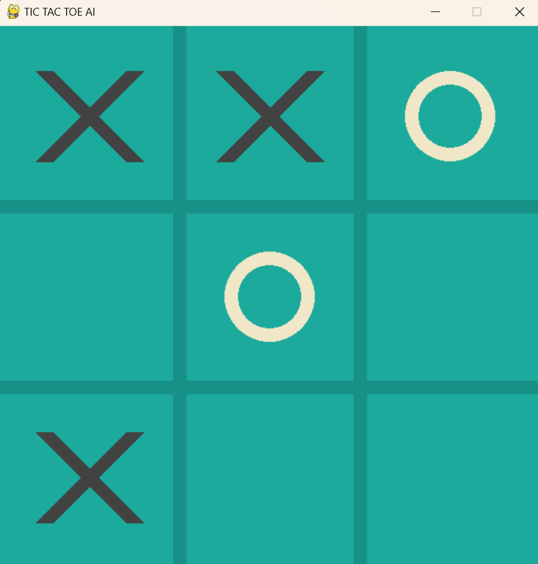

## Artificial Intelligence-Powered Unbeatable Tic Tac Toe

**Project Overview:**

This project showcases an implementation of Tic Tac Toe empowered by artificial intelligence. Programmed in Python with the Pygame library, it offers two game modes: Human vs Human and AI vs Human. The primary goal was to develop an AI opponent that would provide a formidable challenge to human players.

**Contributions:**

- **📅 Situation:** The project was initiated to create an interactive Tic Tac Toe game with an unbeatable AI opponent. This stemmed from the challenge of designing an AI capable of consistently defeating human players in the game.
  
- **🎯 Task:** The main task was to implement the game using Python and Pygame, integrating an AI opponent that would employ sophisticated strategies to achieve victory or, at worst, a draw.
  
- **⚙️ Action:** 
    - Programmed the game logic and user interface using Python and Pygame, ensuring smooth gameplay experience for both human and AI players.
    - Implemented the Minimax algorithm, a decision-making algorithm used in game theory, to determine the optimal moves for the AI player.
    - Incorporated two game modes: Human vs Human and AI vs Human, providing flexibility for players to challenge each other or the AI.
    - Adhered to Object-Oriented Programming (OOP) principles, organizing the code into classes and employing encapsulation for a modular, maintainable, and reusable codebase.
  
- **📈 Result:** 
    - Successfully developed an AI opponent that utilizes the Minimax algorithm to make optimal moves in Tic Tac Toe.
    - Human players found it exceedingly difficult to defeat the AI, with the best achievable outcome being a draw.
    - The adherence to OOP principles ensured a clean, organized codebase, facilitating easier maintenance and future enhancements.

By following this approach, the project delivered an engaging and challenging Tic Tac Toe game experience, showcasing the power of artificial intelligence in gaming applications.
